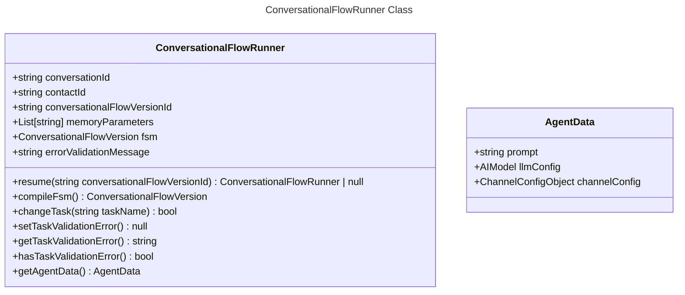
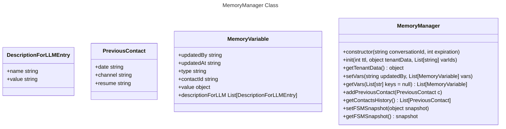
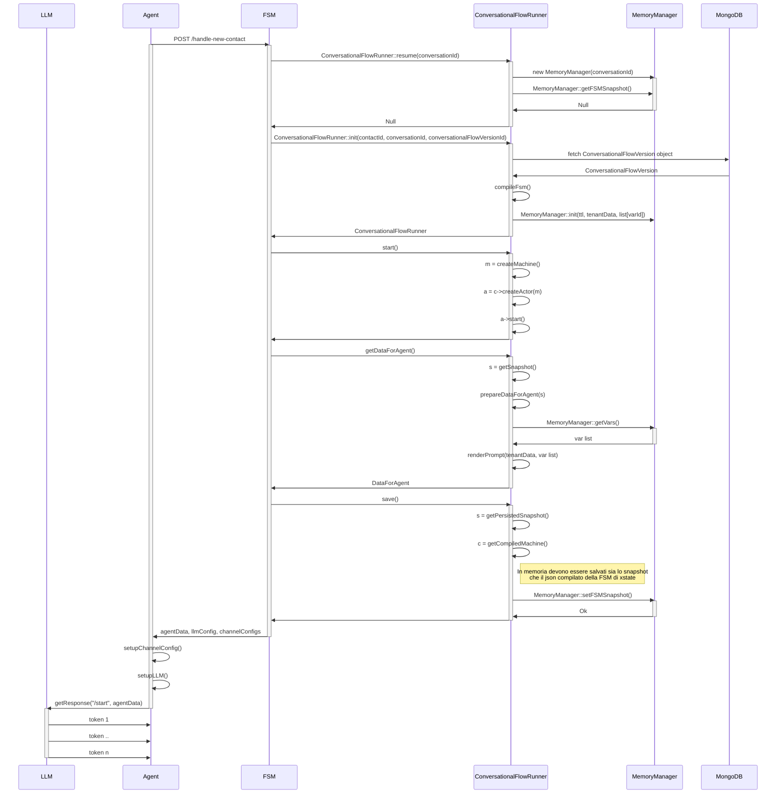
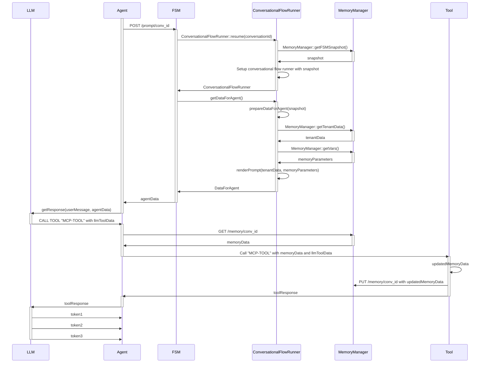
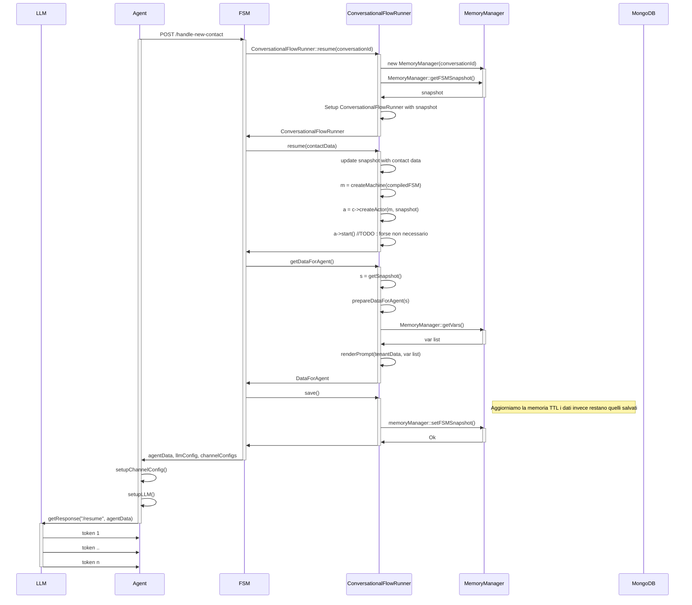
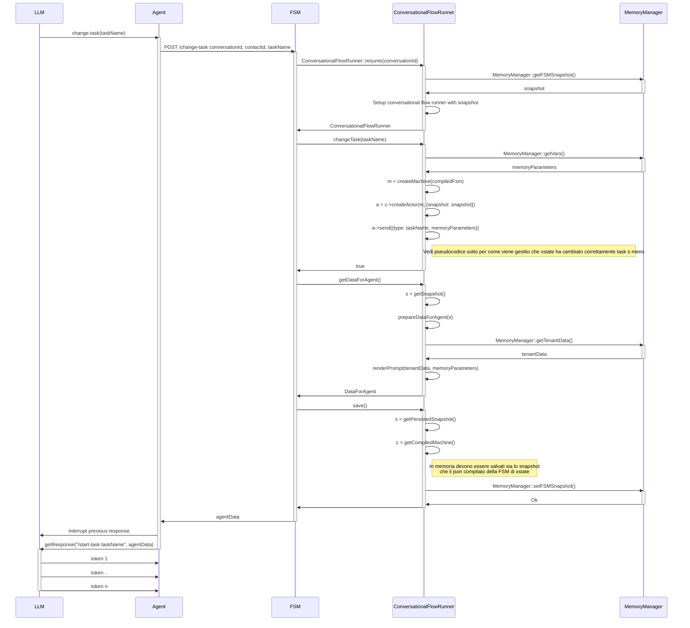

# Flow engine \- Architettura e API

**Implementazione Macchina a Stati**

L’idea è di utilizzare la libreria xstate  [https://stately.ai/docs/quick-start](https://stately.ai/docs/quick-start) e sviluppare tutti i servizi esposti in typescript usando la libreria arrest.

**Variabili e tipi configurabili in un Conversational Flow**

Le variabili indicate nel conversational flow verranno identificate (con alcune limitazioni, vedi sotto) automaticamente a livello di sistema e memorizzate nella memoria.

Saranno quindi riportate, con i valori identificati, all’interno del prompt di interazione con l’utente.

Un task potrà avere come parametri d’ingresso SOLO e SOLTANTO variabili indicate globalmente a livello di Conversational Flow. Unica eccezione in tal senso sono i task di tipo HUM e AIS che avranno dei parametri di routing settati direttamente a livello di interfaccia (e quindi non globalmente).

### **Tipi Primitivi**

* string  
* number  
* boolean  
* enum (elenco finito di stringhe o numeri)

### **Tipi Complessi Predefiniti**

* date: data in formato ISO TZ UTC  
* phone:  
  * country  
  * land/mobile  
  * numero in E164

### **Tipi Custom**

Un tipo “custom” può essere un oggetto (complesso a piacere) piuttosto che una lista di oggetti (o stringhe).

---

Le variabili vanno dichiarate nella relativa sezione globale del Conversational Flow.

Ogni variabile è composta da queste proprietà:

* id: identificativo univoco (nome) della variabile  
* type: uno dei tipi indicati sopra  
* description: prompt per l’AI per estrarre la variabile

Le variabili di tipo custom non vengono mai rilevate automaticamente dall’AI che interagisce con l’utente se non solo tramite degli appositi tool esposti via MCP.

I tool MCP potranno quindi scrivere il dato nella memoria della conversazione indicando obbligatoriamente questi dati:

* Id della variabile (così come riportato globalmente nel conversational flow)  
* Oggetto in formato JSON (dal punto di vista del tool per riutilizzi successivi a livello API)  
* Descrizione del contenuto della variabile dal punto di vista dell’AI. In pratica questo valore verrebbe sempre inserito nel prompt che si invia all’AI che interagisce con l’utente.

Nei tool MCP vengono sempre iniettati programmaticamente tenantId, conversationId e contactId così da rendere possibile l’interfacciamento con le API di memoria.

#### **Raccolta delle variabili durante il dialogo**

Ad ogni utterance dell’utente, i vari agent devono comunicare (oppure il flow si mette in ascolto degli eventi dalla Core CTI) l’utterance appena ricevuta così che il Flow esegue in background una ricerca delle variabili non custom indicate in precedenza e, se valide, procede a memorizzarle.

Questo processo di raccolta automatica è possibile solo per le variabili che non siano di tipo custom.

Nel prompt di estrazione verranno inseriti gli ultimi passaggi di dialogo ed i prompt relativi di ogni variabile.

Se le variabili sono già state scritte in memoria da un tool, il processo non andrà a sovrascrivere il dato.

Il processo di estrazione avrà un timeout predefinito a livello di piattaforma (per evitare migliaia di richieste).

### **Struttura della memoria**
```json
Struttura della memoria
// la chiave tenant viene scritta una volta sola all'inizio della conversazione
conversation_id::tenant => { oggetto con tutti i dati che arrivano dalla configurazione del tenant (id campaign, tenant name, parametri di template)}

// In fase di setup la memoria viene inizializzata con tutte le variabili "vuote"
// Vengono create due hash redis:
// - conversation_id::vars::convMiner => in questa chiave vengono memorizzate le variabili estratte dall'Ai Helper ConvMiner
// - conversation_id::vars::tools => in questa chiave vengono memorizzate le variabili estratte da uno o più tool

// Quando viene ritornata la memoria viene fatto il merge tra i dati del convMiner e quelli dei tools
// Il merge farà sì che i dati del convMiner siano sovrascritti da quanto ha scritto un tool (rispondendo all'esigenza 
// indicata nella gestione della memoria)

// I campi delle due chiavi redis sono gli id delle variabili. Il contenuto è un oggetto secondo questa struttura:
{
    updatedBy: "convMiner|toolName",
    updatedAt: string,
    value: {object},
    contactId: string,
    descriptionForLLM: [
      {name: "skey1", value: "value1"}
      {name: "skey2", value: "value2"}
    ]
}

In valori con cui si inizializzano le strutture sono
{
    updatedBy: null,
    updatedAt: null,  
    type: string|number|custom,
    contactId: string,
    value: null,
    descriptionForLLM: null
}

Esempio di contenuto dopo le prime scritture:

conversation_id::vars::convMiner => {
  data: {
    updatedBy: "convMiner",
    updatedAt: "XXXX",
    value: "10 ottobre",
    contactId: "YYYYY",
    descriptionForLLM: null
  }
}

conversation_id::vars::tools => {
  prestazione: {
    updatedBy: "ricercaPrestazione",
    updatedAt: "ZZZZZ",
    value: {idPrestazione: "SSSS", tipoPrestazione: "TTTT"},
    contactId: "YYYYY",
    descriptionForLLM: [
      {name: "Id", value: "SSSS"}
      {name: "Tipo", value: "TTTT"}
    ]
  }
}
```

Nel rendering del prompt per gli agent, la memoria viene poi renderizzata in una tabella markdown con questa struttura (partendo dall'esempio)
(oppure in formato https://github.com/toon-format/toon ):
|var|property|value|
|-|-|-|
|data||10 ottobre|
|prestazione|Id|SSSS|
|prestazione|Tipo|TTTT|

In questo modo si evitano anche sovrapposizioni e conflitti di naming tra i vari tools.

Esiste poi una sezione specifica della memoria per gestire la storia dei contatti precedenti all'interno di una conversazione multicontatto
```json
conversation_id::previousContacts => [{
  date: string, // data di creazione del contatto
  channel: string, // canale (web, whatsapp, et)
  resume: string // riassungo della conversazione
}]
```

## **Template dei prompt e delle descrizioni utilizzate per configurare il prompt di un task**

All’interno dei campi “prompt” e “descrizione” di un task (come anche per il global prompt del conversational flow) è possibile utilizzare un motore di template che consente di dinamicizzare il template stesso.

Il template viene renderizzato all’ingresso in un task e rimane costante (al netto della memoria) fintanto che si rimane all’interno del task.

TODO non si vuole impedire di far riferimento a variabili dentro il prompt, va tenuto in considerazione come rielaborare il template

La memoria “descrittiva” viene riportata alla fine del prompt ritornato ad inizio task e quindi servirà un API lato memoria che risponda in tempi brevi con il testo da inserire. (Eventualmente si può valutare di sottoscriversi ad un broker che notifica l’evento di cambio della memoria \- da decidere anche in base al worker individuato).

L’idea è di usare come engine di template [https://github.com/n8n-io/tournament](https://github.com/n8n-io/tournament) così da uniformare lo stesso tool a quello che si userebbe dentro i server MCP definiti.

Lato frontend N8N usa CodeMirror per il rendering, quindi si potrebbe usare quello nei punti di interfaccia dove vengono specificati i prompt/descrizioni che richiedono poi un rendering con tournament. Vedi [packages/frontend/editor-ui/src/features/shared/editors/components/JsEditor/JsEditor.vue](https://github.com/n8n-io/n8n/blob/afd40c67093e551fc5c16dd39c57bf54446e32e3/packages/frontend/editor-ui/src/features/shared/editors/components/JsEditor/JsEditor.vue#L21)

Nel template del prompt o della descrizione ci sarebbe l’idea di mettere a disposizione una funzione di autocompletamento con consenta di fare riferimento al nome della variabile inserita globale sotto forma di {{ $vars.idPrestazione }}. Verrebbe sostituita con il nome della variabile facendo riferimento alla parte di memoria. Ad esempio memory-\>idPrestazione invitando quindi il modello a cercare il valore nella memoria riportata a fine prompt.

## **Conversational Flow Class Definitions**

TODO inserire la parte di config nel record del conversational flow delle reason of call e dei result

### **Schema Validation for api arrest**
```json
{
  "openapi": "3.1.0",
  "info": {
    "title": "Flow Engine API",
    "version": "1.0.0",
    "description": "Conversational Flow Engine REST API for managing conversational flows with Finite State Machines"
  },
  "components": {
    "schemas": {
      "AIHelper": {
        "type": "object",
        "description": "AIHelper configuration - flexible schema allowing any properties for future extensibility"
      },
      "AudioMediaConfig": {
        "type": "object",
        "required": [
          "presetId"
        ],
        "allOf": [
          {
            "type": "object",
            "properties": {
              "presetId": {
                "type": "string",
                "description": "Reference to one of the preset of the platform. One is always present and it's called 'default'",
                "default": "default"
              }
            }
          },
          {
            "$ref": "#/components/schemas/BaseAudioMediaConfig"
          }
        ]
      },
      "AudioMediaConfigPreset": {
        "type": "object",
        "required": [
          "llm",
          "stt",
          "tts",
          "vad",
          "allowInterruptionsOnStart",
          "allowInterruptions",
          "enableRecording",
          "userInteractionTimeout",
          "preemptiveGeneration"
        ],
        "allOf": [
          {
            "$ref": "#/components/schemas/BaseAudioMediaConfig"
          }
        ]
      },
      "BaseAudioMediaConfig": {
        "type": "object",
        "properties": {
          "llm": {
            "$ref": "#/components/schemas/LLMConfig"
          },
          "stt": {
            "$ref": "#/components/schemas/STTConfig"
          },
          "tts": {
            "$ref": "#/components/schemas/TTSConfig"
          },
          "vad": {
            "$ref": "#/components/schemas/VADConfig"
          },
          "allowInterruptionsOnStart": {
            "type": "boolean",
            "description": "Controls if user can interrupt AI when playing the first message"
          },
          "allowInterruptions": {
            "type": "boolean",
            "description": "Controls if user can interrupt AI in messages after the first message played"
          },
          "courtesyMessageConfig": {
            "description": "Contains the configuration for enabling courtesy messages. If not set, courtesy messages are disabled",
            "anyOf": [
              {
                "$ref": "#/components/schemas/CourtesyMessageConfig"
              },
              {
                "type": "null"
              }
            ]
          },
          "enableRecording": {
            "type": "boolean",
            "description": "Enables recording of the conversation",
            "default": false
          },
          "userInteractionTimeout": {
            "type": "number",
            "description": "Maximum waiting time (in seconds) for user response before triggering a no_utterance event.",
            "default": 20
          },
          "preemptiveGeneration": {
            "type": "boolean",
            "description": "If true, the LLM can start generating responses before the user finishes speaking.",
            "default": false
          }
        }
      },
      "BaseSTTConfig": {
        "type": "object",
        "required": [
          "provider"
        ],
        "properties": {
          "provider": {
            "type": "string",
            "pattern": "^google|deepgram|openai|{{ .+ }}$"
          },
          "recognitionTimeout": {
            "type": "number",
            "description": "Time to wait before issuing an unclear utterance message",
            "default": 2.5
          },
          "streaming": {
            "type": "boolean",
            "description": "Enables or disables streaming STT mode.",
            "default": false
          },
          "interimResults": {
            "type": "boolean",
            "description": "Enables interim (partial) recognition results during streaming.",
            "default": false
          },
          "hints": {
            "type": "array",
            "items": {
              "type": "string"
            },
            "description": "Optional vocabulary hints to improve speech recognition accuracy.",
            "default": []
          },
          "hintsBoost": {
            "type": "number",
            "description": "Weight multiplier applied to hints.",
            "default": 1
          },
          "minEndpointingDelay": {
            "type": "number",
            "description": "Minimum delay that is waited after user ends to speak and turn detection thinks the turn is ended",
            "default": 1.5
          },
          "maxEndpointingDelay": {
            "type": "number",
            "description": "Maximum delay that is waited after user ends to speak and turn detection thinks the turn is NOT yet ended",
            "default": 3
          },
          "minInterruptionDuration": {
            "type": "number",
            "description": "User must speak at least this duration to interrupt the bot speaking",
            "default": 0.7
          }
        }
      },
      "BaseTTSConfig": {
        "type": "object",
        "required": [
          "provider",
          "voice"
        ],
        "properties": {
          "provider": {
            "type": "string",
            "pattern": "^google|elevenlabs|openai|{{ .+ }}$"
          },
          "voice": {
            "type": "string",
            "description": "(Template of) Voice ID according to provider specifications"
          },
          "speed": {
            "type": "number",
            "default": 1
          }
        }
      },
      "Checkpoint": {
        "type": "object",
        "required": [
          "_id",
          "name",
          "prompt"
        ],
        "properties": {
          "_id": {
            "type": "string"
          },
          "name": {
            "type": "string",
            "description": "Name of the Checkpoint"
          },
          "prompt": {
            "type": "string",
            "description": "The LLM prompt used to identify the Checkpoint"
          },
          "required": {
            "type": "boolean",
            "description": "The flag that indicates if the current checkpoint is mandatory",
            "default": false
          }
        }
      },
      "ClosureConfig": {
        "type": "object",
        "required": [
          "multiContact"
        ],
        "properties": {
          "multiContact": {
            "type": "boolean",
            "description": "If it's false a conversation is closed when the contact that originated it terminates. If it's true, conversationTimeLimit and customHandler will determinate the behaviour at the end of a contact",
            "default": false
          },
          "conversationTimeLimit": {
            "type": "number",
            "description": "Defines the maximum absolute duration of the conversation in seconds. Mandatory if multiContact is true"
          },
          "customHandler": {
            "type": "string",
            "pattern": "^https?://(?:www\\.)?[-a-zA-Z0-9@:%.+~#=]{1,256}\\.[a-zA-Z0-9()]{1,6}\\b(?:[-a-zA-Z0-9()@:%+.~#?&/=]*)$",
            "description": "Url that will respond true/false (close/don't close) when a contact terminate. Mandatory if multiContact is true"
          }
        },
        "allOf": [
          {
            "if": {
              "properties": {
                "multiContact": {
                  "const": true
                }
              },
              "required": [
                "multiContact"
              ]
            },
            "then": {
              "required": [
                "conversationTimeLimit",
                "customHandler"
              ]
            }
          }
        ]
      },
      "ConversationalFlow": {
        "type": "object",
        "description": "It's the main record that declares the existance of a Conversational Flow within a campaign",
        "additionalProperties": false,
        "required": [
          "_id",
          "name",
          "campaignId",
          "schemaVersion",
          "updatedBy",
          "updatedAt"
        ],
        "properties": {
          "_id": {
            "type": "string",
            "description": "MongoDB ID of the conversational flow"
          },
          "name": {
            "type": "string",
            "description": "Name of the Conversational Flow"
          },
          "campaignId": {
            "type": "string",
            "description": "Reference to the Campaign owning the Conversational Flow"
          },
          "schemaVersion": {
            "$ref": "#/components/schemas/SchemaVersionString"
          },
          "updatedBy": {
            "type": "string",
            "description": "The user that created the Conversational Flow or updated it's name"
          },
          "updatedAt": {
            "type": "string",
            "format": "date-time",
            "description": "ISO Timestamp when the last insert/update operation has been done"
          }
        }
      },
      "ConversationalFlowTask": {
        "type": "object",
        "required": [
          "_id",
          "type",
          "description",
          "prompt",
          "transitionParameters",
          "closureConfig",
          "enabledCheckpoints"
        ],
        "properties": {
          "_id": {
            "type": "string"
          },
          "type": {
            "type": "string",
            "enum": [
              "AIO",
              "AIS",
              "HUM"
            ],
            "description": "The type of the current task: AI only (AIO), human (HUM) or AI supervised (AIS)"
          },
          "description": {
            "type": "string",
            "description": "The prompt used by the AI in order to move to the current task from a linked one"
          },
          "prompt": {
            "type": "string",
            "description": "The prompt used by the AI to describe the current task"
          },
          "transitionParameters": {
            "type": "array",
            "items": {
              "$ref": "#/components/schemas/TransitionParameter"
            }
          },
          "aiHelpers": {
            "type": "array",
            "items": {
              "$ref": "#/components/schemas/AIHelper"
            }
          },
          "channels": {
            "description": "The list of the available channel. In case of null all channels are enabled",
            "anyOf": [
              {
                "type": "array",
                "items": {
                  "type": "string",
                  "enum": [
                    "phone",
                    "whatsapp",
                    "sms",
                    "mail",
                    "chat"
                  ]
                }
              },
              {
                "type": "null"
              }
            ]
          },
          "mcpToolSelection": {
            "type": "array",
            "items": {
              "$ref": "#/components/schemas/MCPToolSelection"
            },
            "description": "The list of MCP Servers available for the current task"
          },
          "closureConfig": {
            "$ref": "#/components/schemas/ClosureConfig",
            "description": "A specific closure config to be used in the specific task. This configuration overrides the one set on the conversational flow."
          },
          "enabledCheckpoints": {
            "type": "array",
            "items": {
              "$ref": "#/components/schemas/Checkpoint"
            },
            "description": "The list of selected checkpoint for the current task"
          },
          "connectedTasks": {
            "type": "array",
            "items": {
              "type": "string"
            },
            "description": "Task ids connected to this one"
          }
        }
      },
      "ConversationalFlowTaskAIO": {
        "properties": {
          "hideTranscriptionToHuman": {
            "type": "boolean",
            "description": "Automatically hide transcriptions to human"
          }
        },
        "allOf": [
          {
            "$ref": "#/components/schemas/ConversationalFlowTask"
          }
        ]
      },
      "ConversationalFlowTaskAIS": {
        "allOf": [
          {
            "$ref": "#/components/schemas/ConversationalFlowTaskHUM"
          }
        ]
      },
      "ConversationalFlowTaskHUM": {
        "required": [
          "routingParameters"
        ],
        "properties": {
          "routingParameters": {
            "$ref": "#/components/schemas/RoutingParameters"
          }
        },
        "allOf": [
          {
            "$ref": "#/components/schemas/ConversationalFlowTask"
          }
        ]
      },
      "ConversationalFlowVersion": {
        "type": "object",
        "description": "It's a version of a conversational flow defined in ConversationalFlow with all the settings needed to render in the UI and also to have a working FSM",
        "additionalProperties": false,
        "required": [
          "draft"
        ],
        "properties": {
          "_id": {
            "type": "string",
            "description": "MongoDB ID of the conversational flow version"
          },
          "schemaVersion": {
            "$ref": "#/components/schemas/SchemaVersionString"
          },
          "conversationalFlowId": {
            "type": "string",
            "description": "Reference to the Conversational Flow"
          },
          "globalPrompt": {
            "type": "string",
            "description": "It's the main prompt that defines the rules of the conversation. It's rendered in every prompt sent to LLM. The template format is the one used by n8n tournament rendering engine."
          },
          "channels": {
            "type": "array",
            "items": {
              "type": "string",
              "enum": [
                "phone",
                "whatsapp",
                "sms",
                "mail",
                "chat"
              ]
            }
          },
          "mandatoryChannels": {
            "type": "array",
            "items": {
              "type": "string",
              "enum": [
                "phone",
                "whatsapp",
                "sms",
                "mail",
                "chat"
              ]
            }
          },
          "closureConfig": {
            "$ref": "#/components/schemas/ClosureConfig"
          },
          "mediaConfig": {
            "$ref": "#/components/schemas/MediaConfig"
          },
          "languageDetection": {
            "$ref": "#/components/schemas/LanguageDetectionConfig"
          },
          "defaultLanguage": {
            "$ref": "#/components/schemas/LanguageCode",
            "description": "Default language when a new conversation starts"
          },
          "supportedLanguages": {
            "type": "array",
            "items": {
              "$ref": "#/components/schemas/LanguageCode"
            },
            "description": "Languages supported by the conversational flow"
          },
          "systemPromptsLanguage": {
            "$ref": "#/components/schemas/LanguageCode",
            "description": "Language used to build the system prompts. The available ones are: it-IT, en-US, es-ES. In case defaultLanguage contains a different language value, the default is en-US."
          },
          "apiVersion": {
            "type": "string",
            "pattern": "^v[0-9]+$",
            "description": "The current version of the system api"
          },
          "variables": {
            "type": "array",
            "items": {
              "$ref": "#/components/schemas/Variable"
            }
          },
          "uiMetadata": {
            "type": "object",
            "description": "The object containing the UI metadata"
          },
          "mcpServers": {
            "type": "array",
            "items": {
              "$ref": "#/components/schemas/MCPServer"
            },
            "description": "The list of MCP Servers available for the current conversational flow"
          },
          "aiHelpers": {
            "type": "array",
            "items": {
              "$ref": "#/components/schemas/AIHelper"
            }
          },
          "tasks": {
            "type": "array",
            "items": {
              "$ref": "#/components/schemas/ConversationalFlowTask"
            }
          },
          "firstTask": {
            "type": "string",
            "description": "Id of the first task to be executed in the flow"
          },
          "checkpoints": {
            "type": "array",
            "items": {
              "$ref": "#/components/schemas/Checkpoint"
            },
            "description": "The list of defined checkpoint for the current conversational flow"
          },
          "reasonsOfContact": {
            "type": "array",
            "items": {
              "type": "object",
              "required": [
                "name",
                "prompt"
              ],
              "properties": {
                "name": {
                  "type": "string",
                  "description": "Declared reason of contact"
                },
                "prompt": {
                  "type": "string",
                  "description": "The prompt used by the AI in order to choose the reason of contact"
                }
              }
            },
            "description": "The list of available reasons of contact"
          },
          "results": {
            "type": "array",
            "items": {
              "type": "object",
              "required": [
                "name",
                "prompt",
                "resultTypes"
              ],
              "properties": {
                "name": {
                  "type": "string",
                  "description": "Declared result"
                },
                "prompt": {
                  "type": "string",
                  "description": "The prompt used by the AI in order to choose the result"
                },
                "resultTypes": {
                  "type": "array",
                  "items": {
                    "type": "string",
                    "enum": [
                      "CL",
                      "UNC",
                      "UC",
                      "Y",
                      "UPS"
                    ]
                  }
                }
              }
            },
            "description": "The list of results"
          },
          "createdBy": {
            "type": "string",
            "description": "The user that created the current flow version"
          },
          "createdAt": {
            "type": "string",
            "format": "date-time",
            "description": "ISO Timestamp when the current conversational flow version has been created"
          },
          "draft": {
            "type": "boolean",
            "description": "If draft is true all other fields are not required",
            "default": false
          }
        },
        "allOf": [
          {
            "if": {
              "properties": {
                "draft": {
                  "const": false
                }
              },
              "required": [
                "draft"
              ]
            },
            "then": {
              "required": [
                "_id",
                "schemaVersion",
                "conversationalFlowId",
                "globalPrompt",
                "channels",
                "mandatoryChannels",
                "closureConfig",
                "mediaConfig",
                "defaultLanguage",
                "supportedLanguages",
                "systemPromptsLanguage",
                "apiVersion",
                "variables",
                "uiMetadata",
                "mcpServers",
                "aiHelpers",
                "tasks",
                "firstTask",
                "checkpoints",
                "reasonsOfContact",
                "results",
                "createdBy",
                "createdAt"
              ]
            }
          }
        ]
      },
      "CourtesyMessageConfig": {
        "type": "object",
        "required": [
          "provider",
          "providerParams",
          "timeout"
        ],
        "properties": {
          "provider": {
            "type": "string",
            "enum": [
              "groq",
              "random"
            ]
          },
          "timeout": {
            "type": "number",
            "description": "Time interval (seconds) before playing the courtesy message"
          },
          "silenceAfterMessage": {
            "type": "number",
            "description": "Time interval (seconds) to wait before playing the AI message after a courtesy message",
            "default": 1
          },
          "providerParams": {
            "oneOf": [
              {
                "$ref": "#/components/schemas/CourtesyMessageGroqParams"
              },
              {
                "$ref": "#/components/schemas/CourtesyMessageRandomParams"
              }
            ]
          }
        }
      },
      "CourtesyMessageGroqParams": {
        "type": "object",
        "properties": {
          "historyMessages": {
            "type": "number",
            "description": "Number of previous messages to include in the courtesy message prompt context",
            "default": 5
          },
          "prompt": {
            "type": "string",
            "description": "Prompt used to generate the courtesy message",
            "default": "[Prompt defined by the system]"
          },
          "temperature": {
            "type": "number",
            "description": "Creativity level of the LLM when generating the courtesy message",
            "default": 0.2
          },
          "maxCompletionTokens": {
            "type": "number",
            "description": "Max number of tokens for the generated courtesy message",
            "default": 30
          },
          "topP": {
            "type": "number",
            "description": "Nucleus sampling parameter for the generated courtesy message",
            "default": 0.8
          },
          "model": {
            "type": "string",
            "enum": [
              "meta-llama/llama-4-scout-17b-16e-instruct"
            ],
            "description": "AI Model used for courtesy message generation. Any model supported by groq is accepted.",
            "default": "meta-llama/llama-4-scout-17b-16e-instruct"
          }
        }
      },
      "CourtesyMessageRandomParams": {
        "type": "object",
        "properties": {
          "messages": {
            "type": "array",
            "items": {
              "$ref": "#/components/schemas/LocalizedText"
            }
          }
        }
      },
      "LLMConfig": {
        "type": "object",
        "properties": {
          "provider": {
            "type": "string",
            "enum": [
              "openai",
              "azure",
              "google",
              "local",
              "groq"
            ]
          },
          "model": {
            "type": "string",
            "description": "Reference to one the models provided by SmileCX"
          },
          "temperature": {
            "type": "number",
            "description": "Defines the \"creativity\" of the AI Model"
          }
        }
      },
      "LanguageCode": {
        "type": "string",
        "description": "Array of languages in BCP 47 format (ISO 639-1 + ISO 3166-1).",
        "example": "it-IT or en-US"
      },
      "LanguageDetectionConfig": {
        "type": "object",
        "properties": {
          "enableLanguageDetection": {
            "type": "boolean",
            "description": "Enables automatic language detection from user input.",
            "default": false
          },
          "minWordsForLanguageDetection": {
            "type": "number",
            "description": "Minimum number of words required to attempt language detection.",
            "default": 2
          },
          "languageDetector": {
            "type": "string",
            "enum": [
              "fasttext",
              "lingua"
            ],
            "description": "Algorithm used for language detection. Supported: \"fasttext\", \"lingua\".",
            "default": "fasttext"
          }
        }
      },
      "LanguageSTTConfig": {
        "type": "object",
        "properties": {
          "language": {
            "type": "string",
            "description": "Language in ISO 639-1 - two chars (en, it, ..)"
          },
          "config": {
            "$ref": "#/components/schemas/BaseSTTConfig"
          }
        }
      },
      "LanguageTTSConfig": {
        "type": "object",
        "properties": {
          "language": {
            "type": "string",
            "description": "Language in ISO 639-1 - two chars (en, it, ..)"
          },
          "config": {
            "$ref": "#/components/schemas/BaseTTSConfig"
          }
        }
      },
      "LocalizedText": {
        "type": "object",
        "required": [
          "language",
          "text"
        ],
        "properties": {
          "language": {
            "type": "string",
            "description": "Language in ISO 639-1 - two chars (en, it, ..)"
          },
          "text": {
            "type": "string"
          }
        }
      },
      "MCPServer": {
        "type": "object",
        "required": [
          "name",
          "url",
          "includedTools"
        ],
        "properties": {
          "name": {
            "type": "string",
            "description": "Name of the MCPServer"
          },
          "url": {
            "type": "string",
            "pattern": "^https?://(?:www\\.)?[-a-zA-Z0-9@:%.+~#=]{1,256}\\.[a-zA-Z0-9()]{1,6}\\b(?:[-a-zA-Z0-9()@:%+.~#?&/=]*)$",
            "description": "The url of the current MCPServer"
          },
          "includedTools": {
            "type": "array",
            "items": {
              "type": "object",
              "properties": {
                "toolName": {
                  "type": "string",
                  "description": "Name of the specific tool"
                },
                "uiToolDescription": {
                  "type": "string",
                  "description": "The description of the specific tool for selecting in the UI"
                }
              }
            },
            "description": "The list of tools selected inside the specific MCP Server"
          }
        }
      },
      "MCPToolParameter": {
        "type": "object",
        "required": [
          "parameterName",
          "assignmentStrategy",
          "assignmentValue"
        ],
        "properties": {
          "parameterName": {
            "type": "string",
            "description": "The name of the parameter"
          },
          "assignmentStrategy": {
            "type": "string",
            "enum": [
              "variable",
              "fixed",
              "prompt"
            ],
            "description": "The strategy used for assigning the value"
          },
          "assignmentValue": {
            "type": "string",
            "description": "This depends on assignmentStrategy, it could be : <br/>- a variable id <br/>- a fixed value <br/>- a prompt for helping the ai on calculate the real value that should be passed"
          }
        }
      },
      "MCPToolParametersMap": {
        "type": "object",
        "required": [
          "toolName"
        ],
        "properties": {
          "toolName": {
            "type": "string",
            "description": "The name of the tool in the MCP Server"
          },
          "toolParameters": {
            "type": "array",
            "items": {
              "$ref": "#/components/schemas/MCPToolParameter"
            },
            "description": "The list of parameters for the tools selected"
          }
        }
      },
      "MCPToolSelection": {
        "type": "object",
        "required": [
          "mcpServerName",
          "selectedTools"
        ],
        "properties": {
          "mcpServerName": {
            "type": "string",
            "description": "The MCP Server name from the list of MCP Servers supplied by the conversational flow"
          },
          "selectedTools": {
            "type": "array",
            "items": {
              "$ref": "#/components/schemas/MCPToolParametersMap"
            },
            "description": "The list of tools selected for this MCP Server"
          }
        }
      },
      "MediaConfig": {
        "type": "object",
        "required": [
          "audio",
          "text"
        ],
        "properties": {
          "audio": {
            "$ref": "#/components/schemas/AudioMediaConfig"
          },
          "text": {
            "$ref": "#/components/schemas/TextMediaConfig"
          }
        }
      },
      "RoutingParameters": {
        "type": "object",
        "required": [
          "timeout"
        ],
        "properties": {
          "timeout": {
            "type": "number",
            "description": "Time to wait before considering the routing request failed (no answer by agents)"
          },
          "agentSkills": {
            "type": "array",
            "items": {
              "type": "string"
            },
            "description": "Skills required by the routing request"
          },
          "agentOptionalSkills": {
            "type": "array",
            "items": {
              "type": "string"
            },
            "description": "Optional skills required by the routing request"
          },
          "agentIds": {
            "type": "array",
            "items": {
              "type": "string"
            },
            "description": "Specific agents required by the routing request"
          },
          "waitingMusic": {
            "type": "string",
            "pattern": "^https?://(?:www\\.)?[-a-zA-Z0-9@:%.+~#=]{1,256}\\.[a-zA-Z0-9()]{1,6}\\b(?:[-a-zA-Z0-9()@:%+.~#?&/=]*)$",
            "description": "Url to specific music to play during waiting"
          },
          "waitingMusicDuration": {
            "type": "number",
            "description": "Interval between waiting messages"
          },
          "waitingMessagesConfiguration": {
            "$ref": "#/components/schemas/WaitingMessagesConfiguration"
          }
        }
      },
      "STTConfig": {
        "type": "object",
        "required": [
          "default",
          "fallback"
        ],
        "properties": {
          "default": {
            "$ref": "#/components/schemas/BaseSTTConfig"
          },
          "fallback": {
            "$ref": "#/components/schemas/BaseSTTConfig"
          },
          "languageCustomConfig": {
            "anyOf": [
              {
                "type": "array",
                "items": {
                  "$ref": "#/components/schemas/LanguageSTTConfig"
                }
              },
              {
                "type": "null"
              }
            ]
          }
        }
      },
      "SchemaVersionString": {
        "type": "string",
        "description": "Version of the object schema to handle future schema updates or migrations",
        "pattern": "^[0-9]+\\.[0-9]+\\.[0-9]+$",
        "example": "1.0.0"
      },
      "TTSConfig": {
        "type": "object",
        "required": [
          "default",
          "fallback"
        ],
        "properties": {
          "default": {
            "$ref": "#/components/schemas/BaseTTSConfig"
          },
          "fallback": {
            "$ref": "#/components/schemas/BaseTTSConfig"
          },
          "languageCustomConfig": {
            "anyOf": [
              {
                "type": "array",
                "items": {
                  "$ref": "#/components/schemas/LanguageTTSConfig"
                }
              },
              {
                "type": "null"
              }
            ]
          }
        }
      },
      "TextMediaConfig": {
        "type": "object",
        "properties": {
          "llm": {
            "$ref": "#/components/schemas/LLMConfig"
          },
          "courtesyMessageConfig": {
            "description": "Contains the configuration for enabling courtesy messages. If not set, courtesy messages are disabled",
            "anyOf": [
              {
                "$ref": "#/components/schemas/CourtesyMessageConfig"
              },
              {
                "type": "null"
              }
            ]
          },
          "userInteractionTimeout": {
            "description": "Maximum waiting time (in seconds) for user response before triggering a no_utterance event. (default: never)",
            "anyOf": [
              {
                "type": "number"
              },
              {
                "type": "null"
              }
            ]
          }
        }
      },
      "TransitionParameter": {
        "type": "object",
        "required": [
          "variableId",
          "required"
        ],
        "properties": {
          "variableId": {
            "type": "string",
            "description": "The id of the variable selected from the available variables for the conversational flow"
          },
          "required": {
            "type": "boolean"
          }
        }
      },
      "VADConfig": {
        "type": "object",
        "properties": {
          "activationThreshold": {
            "type": "number",
            "description": "Threshold to consider a frame as speech.",
            "default": 0.5
          },
          "maxBufferedSpeech": {
            "type": "number",
            "description": "Maximum duration of speech to keep in the buffer (in seconds).",
            "default": 60
          },
          "minSilenceDuration": {
            "type": "number",
            "description": "At the end of each speech, wait this duration before ending the speech.",
            "default": 0.8
          },
          "minSpeechDuration": {
            "type": "number",
            "description": "Minimum duration of speech to start a new speech chunk.",
            "default": 0.08
          },
          "prefixPaddingDuration": {
            "type": "number",
            "description": "Duration of padding to add to the beginning of each speech chunk.",
            "default": 0.5
          }
        }
      },
      "Variable": {
        "type": "object",
        "required": [
          "_id",
          "name",
          "type"
        ],
        "properties": {
          "_id": {
            "type": "string"
          },
          "name": {
            "type": "string",
            "description": "Variable name"
          },
          "type": {
            "type": "string",
            "enum": [
              "string",
              "number",
              "boolean",
              "enum",
              "date",
              "phone",
              "custom"
            ],
            "description": "Variable type"
          },
          "enumValues": {
            "type": "array",
            "items": {
              "type": "string"
            }
          },
          "prompt": {
            "type": "string",
            "description": "The prompt used by the AI in order to identify the variable"
          }
        },
        "if": {
          "not": {
            "properties": {
              "type": {
                "const": "custom"
              }
            }
          }
        },
        "then": {
          "required": [
            "prompt"
          ]
        }
      },
      "WaitingMessagesConfiguration": {
        "type": "object",
        "required": [
          "generationStrategy"
        ],
        "properties": {
          "generationStrategy": {
            "type": "string",
            "enum": [
              "fixed",
              "prompt"
            ],
            "description": "Strategy to generate waiting messages"
          },
          "prompt": {
            "type": "string",
            "description": "Prompt for generating waiting messages"
          },
          "messagesList": {
            "type": "array",
            "items": {
              "$ref": "#/components/schemas/LocalizedText"
            }
          }
        },
        "if": {
          "properties": {
            "generationStrategy": {
              "const": "prompt"
            }
          }
        },
        "then": {
          "required": [
            "prompt"
          ]
        },
        "else": {
          "required": [
            "messagesList"
          ]
        }
      }
    }
  }
}
```

Note:

* Regole per il salvataggio delle versioni  
  * se UI passa parentVersionId a null oppure parentVersionId corrisponde ad una versione con tag latest: viene aggiornato il tag latest con l’id della nuova versione  
  * se UI passa parentVersionId e parentVersionId corrisponde ad una versione con un tag:  
    * se non viene passato un nuovo tag il salvataggio viene negato  
    * se viene passato un nuovo tag il salvataggio va a buon fine

### **Versioning dei prompt di sistema e dei server MCP di sistema**

I prompt di sistema saranno dichiarati in file JSON associati alla versione delle API del flow (V1, V2, …). I prompt saranno suddivisi per modello e lingua. Ogni file relativo conterrà un elenco dei vari prompt (o pezzi di prompt) che saranno utilizzati per creare il prompt da passare all’AI.  
Sarà comunque definito un gruppo di prompt “predefinito” (nel caso in cui manchi la lingua o manchi il modello).

Lo stesso vale anche per i server MCP di default esposti. Questi verranno indicati e dichiarati sempre con path corrispondente alla versione delle API del flow.

Modifiche retrocompatibili non comporteranno mai un cambio di versione. Semplicemente sarà necessario aggiornare la versione dei container del flow con il nuovo codice.

Modifiche non retrocompatibili invece, oltre a richiedere un nuovo rollout, richiederanno un aggiornamento specifico dell’api version nei vari conversational flow.

## **API da esporre**

### **UI**

| Method | Scope | Payload/Query String | Response |
| ----- | ----- | ----- | ----- |
| GET /flows | Ritorna l’elenco dei conversational flows e dei relativi tags | Parametri: campaignId channel: *(opt)* canale supportato a livello della singola versione del conversational flow \- se non specificato vengono ritornati tutti i flow definiti all’interno di una campagna. Questo parametro è utile per mostrare una lista di flow compatibili quando si configura un entry point | `[{    id: 1,     name: “c1”,    campaignId: “1”,    templateId: null,    updatedAt: "xxx",    updatedBy: "yyy",    tags: [{     versionId: "1",     tag: "latest",     createdBy: "pippo",     createdAt: "2025-xxxx"    }] }]`  |
| POST /flows | Crea un nuovo Conversational Flow | `{   name: “c1”,   campaignId: “1”,   updatedBy: "zzz" }` | `{   id: "12341" }` |
| PATCH /flows/:id TODO verificare arrest | Aggiorna il nome del Conversational Flow | `{   name: “c2”,   updatedBy: "aaa" }` |  |
| GET /flows/:id/versions | Ritorna l’elenco delle versioni disponibili e taggate di un conversational flow | Parametri: onlyTaggedVersions: boolean | `[{   versionId: "b111",   tag: "v1",   createdBy: "ppp",   createdAt: "zzz", }]` |
| GET /flows/:id/versions/:vid | Ritorna il JSON del flow come salvato dalla UI |  |  |
| POST /flows/:id/versions TODO esporre sintassi completa | Crea una nuova versione del conversational flow | JSON generato da reactdev o strumento utilizzato per la UITODO da verificare gestione tags | `{   versionId: "v7636363" }` |
| TODO Helpers API per frontend | modelli disponibili voci disponibili motori di STT disponibili altre api (ad esempio per migliorare i prompt od altre info) Suggerimento: per migliorare il prompt della descrizione di un task (che è la regola per passare all’llm) si potrebbe inviare la descrizione ad un llm chiedendo di migliorarla. Tipo questo: *Trasforma la frase seguente in una regola che un LLM dovrebbe seguire per passare ad un task "prestazione": Questo task ha il compito di ricercare la prestazione detta da un utente per poi prenotare in agenda.* |  |  |

### 

### 

### 

### 

### 

### **Agents API**

| Method | Scope | Payload/Query String | Response |
| ----- | ----- | ----- | ----- |
| POST /handle-new-contact | L’agent (livekit o channel) comunica l’inizio di un nuovo contatto alla FSM. L’api controlla in Redis se esiste già una FSM avviata per la conversation e decide se avviarne una nuova o fare resume in base alla configurazione del conversationalFlow La macchina a stati finiti si registra sugli eventi di Contact End per quel contatto Potrebbe anche ricevere i dati di renderizzazione dei template dei prompt (o potrebbe recuperarli) e salvarli in memoria. Il prompt ritornato è già il prompt renderizzato | `{   contactId: "asdfas",   conversationId: "237da",   conversationalFlowVersionId: "xxx",   channel: "phone" }` | `{   routingParameters: object | null,   taskName: string,   taskType: string,   prompt: string,   mcpServers: [string],   llm: LlmConfig,   tts: TtsConfig,   stt: SttConfig,   vad: VadConfig,   courtesyMessages: CourtesyMessagesConfig,   languageDetection: LanguageDetectionConfig   ... }` |
| POST /change-task | L’agent (livekit o channel) tramite il proprio LLM richiama un tool (interno) che poi richiama questa API per cambiare il task del conversational flow in esecuzione. La macchina a stati deve verificare i parametri obbligatori nel nuovo task interrogando la memoria e se è tutto ok effettua il cambio task. Il prompt ritornato è già il prompt renderizzato perchè va a recuperare le variabili in memoria | `{   contactId: "asdfas",   conversationId: "237da",   task: "task-name" }` | `{   result: true,   prompt: string,   mcpServers: [string],   routingParameters: object | null,   taskName: string,   taskType: string } {   result: false,   reason: "xxxxx" }` |
| POST /handle-end-contact | Questa API viene chiamata da CTI quando termina il contatto e si occuperà di gestire le operazioni di chiusura (ed eventualmente richiedere la chiusura della conversazione). In caso di conversazione multicontatto, questo chiamata genererà anche un riassunto di quanto avvenuto nel contatto che sta terminando e lo salva nella memoria nella sezione dei contatti precedenti. | TODO da verificare le specifiche da parte del core per quanto riguarda la registrazione agli eventi |  |
| GET /prompt/:conv\_id | Questa chiamata ritorna il prompt comprensivo dei dati della memoria renderizzati per l’agente. I dati della memoria verrano renderizzati sotto forma di tabella markdown avente una struttura simile alla seguente: (In alternativa usare [https://github.com/toon-format/toon](https://github.com/toon-format/toon) ) `|key|property|value| |-|-|-| |k1|sk1|value1| |k1|sk2|value2| |k2|sk1|value3| |id_prestazione||ppp1| |prestazione|id|ppp1| |prestazione|descrizione|risonanza|`  |  | `{   prompt: "text" }` |

### **Memory API**

| Method | Scope | Payload/Query String | Response |
| ----- | ----- | ----- | ----- |
| PUT /memory/:conversation\_id | Questa chiamata salva nei dati della memoria le entry indicate. Ogni entry salvata riporterà anche l’updatedBy, l’updatedAt ed il contactId. Questa chiamata viene utilizzata dai tool per memorizzare variabili complesse (e non) individuate durante l’esecuzione. | `[{   updatedBy: string,   updatedAt: string,   contactId: string,   varId: string,   value: object,   descriptionForLLM: [{     name: string,     value: string   }] }]` |  |
| GET /memory/:conv\_id | Ritorna il contenuto completo della memoria per passarlo a dei tool Questa chiamata è eseguita dagli agent (channel, livekit) per ottenere un dump dei dati e passarli ai tool richiamati dal LLM |  | `{   tenant: object,   vars: [{     varId: string,     value: object,   }] }`  |

---

TODO definire il formato del context della FSM perché dovrà contenere informazioni di runtime che non siano nella memoria (tipo la lingua corrente)

Indicativamente:

* contactId:  
  * channel  
  * status

---

TODO Come gestire la deflection → la macchina a stati può avere solo un task in esecuzione in un certo momento

## **Sequence diagram di funzionamento di massima dell’interazione tra un agent e le API esposte dalla macchina a stati**




### **Gestione di un nuovo contact**


### **Gestione di un nuovo messaggio su un contatto attivo e chiamata a tool MCP**




### **Gestione di un cambio task**



```json
/**** Inizio definizione FSM *****/

// Questa è una guard generica che controlla che tutti i parametri obbligatori siano definiti per entrare in un task
// Nell'event ci sarà un proprietà o un metodo da usare come callback da dentro l'isValid per settare un errore di validazione
// ad esempio quando non ci sono i parametri obbligatori
// Nell'event ci sarà quindi anche un array con tutti i parametri compilati ottenuti dalla memory
guards: {
  isValid: ({ context, event }, params ) => {
    // Controllo che event.memoryParameters contenga tutte le chiavi di requiredTaskParameters
    ...
    // In caso di errore
    event.setTaskValidationError("Manca il parametro XXX");

    return true;
  }
}

actions: {
  setCurrentTask: assign(({event}) => {
    return { currentTask: event.type };
  });
}

states: {  
  prestazione: {
    entry: 'setCurrentTask',
    on: {
      "prenotazione": {
          target: 'prenotazione',
          guard: {type: "isValid", params: {requiredTaskParameters: ["idPrestazione"]}},
      },
      "cancellazione": {
          target: 'cancellazione',
          guard: {type: "isValid", params: {requiredTaskParameters: ["idPrestazione"]}},
      },
    },
  },
  prenotazione: {
    entry: 'setCurrentTask',
    on: {},
  }
}

/**** Fine definizione FSM *****/

class ConversationalFlowRunner {
  public changeTask: (taskName) => {
    // Sono in "prestazione" e voglio andare in "prenotazione"
    this.actor.send({
      type: taskName, // (ad esempio "prenotazione")
      memoryParameters: self.memoryParameters,
      setTaskValidationError: this.setTaskValidationError
    });
    
    if (this.hasTaskValidationError) {
      // Errore nel cambio task, invia relativo risultato all'agent
      return false;
    }

   if (this.actor.getSnapshot().context.newTask != taskName) {
     this.setTaskValidationError("Impossibile cambiare stato");
     return false;
   }
    return true;  
  }
}

// Nell'action di FSM che implementa l'API:

if (!conversationalFlowRunner.changeTask(taskName)) {
  return {
    result: false,
    reason: conversationalFlowRunner.getTaskValidationError()
  };
}

d = conversationalFlowRunner.getAgentData();
return {
  result: true,
  agentData: d
};

```

### **Gestione di un cambio task con errore**

TODO Descrivere con un sequence diagram quello che avviene alla fine di un contatto (la chiamata handle-end-contact)

## **Composizione del prompt**

### **Comandi del prompt**

* /start  
* /start\_task nell’invio di questo comando (che va nell’history dei messaggi) va indicato il nome del task, il tipo del task. Nel caso di task HUM e AIS verrebbero anche riportati i tag o i nomi degli agenti a cui si vuole trasferire o far monitorare la chiamata  
* /error serve per riportare eventuali errori a livello di macchina a stati (come ad esempio errore nel change task)  
* /human\_task\_completed serve per comunicare l’esito con successo di un trasferimento e nel caso passare ad uno stato successivo  
* /human\_task\_failedserve per comunicare l’esito fallito (con la motivazione) di un trasferimento e nel caso passare ad uno stato successivo

TODO allineare la terminologia dei comandi

### **Dati da aggiungere nel prompt**

* va aggiunta la data/ora attuale  
* Va aggiunta la data/ora di aggiornamento della memoria  
* Ba aggiunto il delta tra ora attuale e ultimo aggiornamento  
* Per ogni dato di memoria aggiungere la data/a di aggiornamento (forse no nel prompt)  
* vanno aggiunti i dati dell’utente (numero chiamante, altre info)  
* va aggiunta alla fine la memoria delle variabili di conversational flow  
* va indicato il canale con cui l’utente si sta esprimendo  
* nel caso di un task human, indicare con un prompt di sistema che stiamo trasferendo ad un umano indicando anche i relativi tag di trasferimento  
* in caso di conversazione multicontatto, va aggiunta sempre la history dei contatti precedenti.

## **Invio Dati a Core CTI/Reportistica**

Il channel agent e livekit agent inviano a Core tutti i messaggi interscambiati tra utente, bot ed operatore (al netto di quelli per cui dovesse venir sospesa la trascrizione \- task solo HUM).

Ogni messaggio inviato attualmente in livekit riporta questi dati:

```json
// esempio livekit
{
    serviceId: str (campaignId)
    room: str (Identificativo della stanza dell'agent)
    callerId: str
    calleeId: str
    ts: str (data creazione messaggio)
    participantId: str
    participantName: str | None = None
    agent: bool (dice se è un agente o meno)
    isBot: bool (dice se è il bot o meno)
    body: str
    participantAvatar: str | None = None
    meta: dict | None = None (all'interno flag per visible = false o meno -> task dove trascrizione sospesa per operatori)
    extId: str | None = None (uuid chiamata freeswitch))
}
```
Nel nuovo prodotto questa potrebbe essere un’alternativa

```json
{
    campaignId: str
    conversationId: str
    contactId: str
    ts: str (data creazione messaggio)
    body: str
    type: tool|system|message
    src: bot|agent|user
    srcId: str
    srcName: str
    taskName: str
    taskType: str (HUM|AIS|AIO)
    taskStatus: str (HUM|AIS|AIO) stato del task durante la ricezione del messaggio (un task AIS potrebbe essere stato preso in gestione da un HUM)
    meta: dict | None = None (all'interno flag per visible = false o meno -> task dove trascrizione sospesa per operatori)
}
```

Per i messaggi di tipo system il body sarà un oggetto e andranno censiti i diversi sottotipi che verranno incontrati durante lo sviluppo (ad esempio l’hangup potrebbe avere essere riferito a bot, agent, user, o la route request potrebbe specificare gli skill richiesti)

L’evento di un checkpoint attuale in livekit è un evento fatto così:
```json
{
  serviceId: str,
  room: str,
  callerId: str,
  calleeId: str,
  type: (liberi: success, navigation, ...),
  data: dati del checkpoint
}
```

Nel nuovo prodotto:

```json
{
  serviceId: str,
  room: str,
  callerId: str,
  calleeId: str,
  type: (liberi: success, navigation, ...),
  data: dati del checkpoint
}
```
